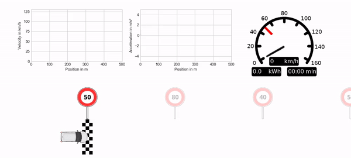

# gym-longicontrol
This repository is a fork of the gym_longicontrol repository from the link. That repository contains the simulation environment of longitudinal car driving with given speed restrictions and the codes that train the model with the help of reinforcement learning and do the evaluation. This fork contains upadated codes and files so that can work properly on Google Colaboratory at the moment. Updates concerns the main part of the repository in which we train model and visualize the results on example by mp4 video. File with car model data were added to the repository and new pickle file is created. Training and visualization process is controled by main.ipynb.
We often encounter programs whose codes are out of date due to the constant updating of libraries.

We aim to combine real-world motivated RL with easy accessibility within a highly relevant problem: the stochastic longitudinal control of an autonomous vehicle.
The [LongiControl](https://doi.org/10.5220/0010305210301037) environment consists of a data based electric vehicle model (the Downloadable Dynamometer Database [D3](https://www.anl.gov/es/downloadable-dynamometer-database) of the Argonne National Laboratory is used here) and a single-lane track with stochastic speed restrictions. The state of the agent includes the actual speed, previous acceleration, current speed limit and the next speed limit as long as it is within a visual range of 150m. The agent selects the acceleration of the vehicle and receives as a reward a combination of speed, energy consumption, jerk and a measure for speeding. 
LongiControl could be used to elaborate various challenges within Reinforcement Learning. E.g. MORL due to excplicitly contradictory reward terms (minimize energy consumption, travel time, jerk), SafeRL (comply with speed limits) or Explainable AI (as the problem is quite easy to grasp; also see our study on this [here](https://doi.org/10.5220/0010256208740881)).


Please use this bibtex if you want to cite this repository in your publications:

```
@conference{icaart21,
  author={Dohmen, Jan and Liessner, Roman and Friebel, Christoph and Bäker, Bernard},
  title={LongiControl: A Reinforcement Learning Environment for Longitudinal Vehicle Control},
  booktitle={Proceedings of the 13th International Conference on Agents and Artificial Intelligence - Volume 2: ICAART,},
  year={2021},
  pages={1030-1037},
  publisher={SciTePress},
  organization={INSTICC},
  doi={10.5220/0010305210301037},
  isbn={978-989-758-484-8},
}

```


## Requirements
- Python 3
- OpenAI Gym
- Numpy, Scikit-learn, Pandas

- Pytorch to train/use the given RL agent
- Pyglet, Matplotlib, Seaborn for visualization


## Install
```
cd gym-longicontrol
pip install -e .
```


## Usage
Instances of the environment can be created and handled similar to other Gym environments:
- `gym.make('gym_longicontrol:DeterministicTrack-v0')`
- `gym.make('gym_longicontrol:StochasticTrack-v0')`


## Example with built-in RL agent

### Training
We can train the model by run main.py and specify save_id argument (if we want to train new model) or load_id argument (if we want to continue train existing model).
```
cd gym-longicontrol/rl/pytorch
python main.py --save_id 9
```
```
cd gym-longicontrol/rl/pytorch
python main.py --load_id 9
```
If we want to save videos from steps of training we can pass -rec argument. We can specify parameters of ... by sending aditional arguments that are presented in gym-longicontrol/rl/pytorch/arguments.py.

A trained agent is given in `gym-longicontrol/rl/pytorch/out`:
- .tar ... model and weights
- .out ... quick overview of the training results
- .npy ... more detailed information about the course of training (can be used within the jupyter notebook `gym-longicontrol/rl/pytorch/monitor.ipynb`)


### Visualize
If we want to load the trained model and visualize an example track that will be saved as mp4 video we need to specify load_id and pass -vis and -rec arguments:
```
cd gym-longicontrol/rl/pytorch
python main.py --load_id 9 --env_id StochasticTrack-v0 -vis -rec
```

#### Examples
<details>
  <summary>Agent right after initialisation</summary>
  
  <p align="center">
  
  </p>
</details>

<details>
  <summary>Early stage agent has learned to complete the track</summary>
  
  <p align="center">
  
  </p>
</details>

<details open>
  <summary>Well trained agent</summary>
  
  <p align="center">
  
  </p>
</details>


